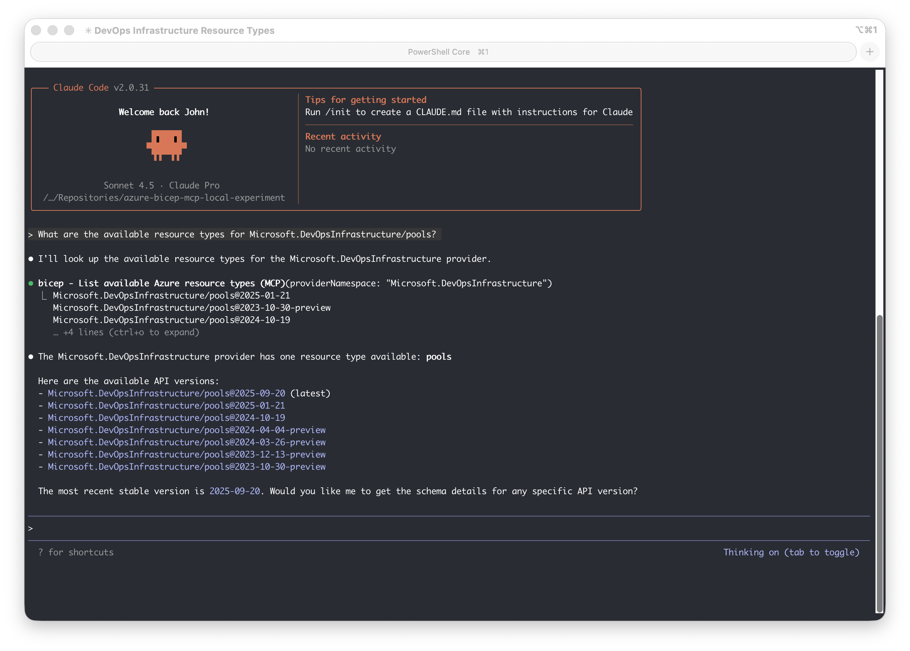

# Azure Bicep MCP Server (Experimental) Integrations with other AI services

This guide explains how to run the Azure Bicep MCP server locally for Claude Desktop and Code, OpenAI Codex CLI and for LMStudio where you can use it with various models.

See the Claude Code example:



## Overview

The Bicep MCP (Model Context Protocol) server provides AI agents with tools to help generate high-quality Bicep code. It exposes the following tools:

- `list_az_resource_types_for_provider` - Lists all available Azure resource types for a specific provider
- `get_az_resource_type_schema` - Gets the schema for a specific Azure resource type and API version
- `get_bicep_best_practices` - Returns Bicep best practices and guidelines
- `list_avm_metadata` - Lists metadata for all Azure Verified Modules (AVM)

Checkout the [Bicep MCP Server Documentation](https://github.com/Azure/bicep/blob/main/docs/experimental/mcp-tools.md) for more information.

## Prerequisites

- [.NET 10.0 SDK](https://dotnet.microsoft.com/en-us/download/dotnet/10.0?WT.mc_id=MVP_323261) or later (tested with .NET 10.0)
- Git (for cloning the repository)

### Options

There are two options to get the Bicep MCP server DLL:
* Option 1: Build from source (more control, easier to update)
* Option 2: Extract from VS Code extension (easiest approach)

### Option 1: Build from Source

This approach clones the Bicep repository and builds the MCP server. Updates are as simple as `git pull` and rebuild.

#### Initial Setup

```bash
# Clone and build the Bicep repository
./scripts/Setup-BicepMCP.ps1
```

#### Running the Server

You can run the MCP server directly from the extension path. However it is not required to run it separately since clients will launch it as needed. To run it in a specific client see: [Client Setup Guides](#client-setup-guides). To run it locally see:

```bash
# Find the DLL
find src/Bicep.McpServer/bin/Release -name "Bicep.McpServer.dll"

# Run it
dotnet ./src/Bicep.McpServer/bin/Release/net10.0/Bicep.McpServer.dll
```

#### Updating

```bash
# Pull latest changes and rebuild the project
./scripts/Update-BicepRepo.ps1
```

### Option 2: Extract from VS Code Extension (easiest approach)

If you already have the Bicep VS Code extension installed, you can use the MCP server DLL directly from it.

#### Locate the Extension

The extension is typically installed at:

- **macOS**: `~/.vscode/extensions/ms-azuretools.vscode-bicep-<version>/`
- **Linux**: `~/.vscode/extensions/ms-azuretools.vscode-bicep-<version>/`
- **Windows**: `%USERPROFILE%\.vscode\extensions\ms-azuretools.vscode-bicep-<version>\`

The MCP server is located at: `bicepMcpServer/Bicep.McpServer.dll`

#### Running from Extension

You can run the MCP server directly from the extension path. However it is not required to run it separately since clients will launch it as needed. To run it in a specific client see: [Client Setup Guides](#client-setup-guides). To run it locally see:

```bash
# Find your extension version
ls ~/.vscode/extensions/ | grep vscode-bicep

# Run the MCP server (replace <version> with your actual version)
dotnet ~/.vscode/extensions/ms-azuretools.vscode-bicep-<version>/bicepMcpServer/Bicep.McpServer.dll
```

## Helper Scripts

The following PowerShell scripts are provided to simplify setup and maintenance:

| Script                                               | Description                                                                                                                                            |
| ---------------------------------------------------- | ------------------------------------------------------------------------------------------------------------------------------------------------------ |
| [Setup-BicepMCP.ps1](scripts/Setup-BicepMCP.ps1)     | Clones the Bicep repository (if not already present) and builds the MCP server. Outputs configuration instructions for Claude Desktop and Claude Code. |
| [Update-BicepRepo.ps1](scripts/Update-BicepRepo.ps1) | Pulls the latest changes from the Bicep repository and rebuilds the MCP server.                                                                        |
| [Run-BicepMCP.ps1](scripts/Run-BicepMCP.ps1)         | Starts the Bicep MCP server using stdio transport.                                                                                                     |

## Client Setup Guides

- **[Claude Code Setup](docs/claude-code-setup.md)** - Configure the MCP server for Claude Code (CLI)
- **[Claude Desktop Setup](docs/claude-desktop-setup.md)** - Configure the MCP server for Claude Desktop
- **[Codex CLI Setup](docs/codex-cli-setup.md)** - Configure the MCP server for Codex CLI
- **[LMStudio Setup](docs/lmstudio-setup.md)** - Configure the MCP server for LMStudio
- **GitHub Copilot Setup**: Recommended to use the Azure Bicep extension's built-in MCP support.

## How It Works

The Bicep MCP server:

1. Uses the [Model Context Protocol](https://modelcontextprotocol.io/) for AI agent integrations
2. Communicates via **stdio** (standard input/output)
3. Provides tools for Azure resource type information and Bicep best practices
4. Is built on .NET 10.0 using Microsoft's MCP SDK

## References

- [Azure Bicep Repository](https://github.com/Azure/bicep)
- [Bicep MCP Server Documentation](https://github.com/Azure/bicep/blob/main/docs/experimental/mcp-tools.md)
- [Model Context Protocol](https://modelcontextprotocol.io/)
