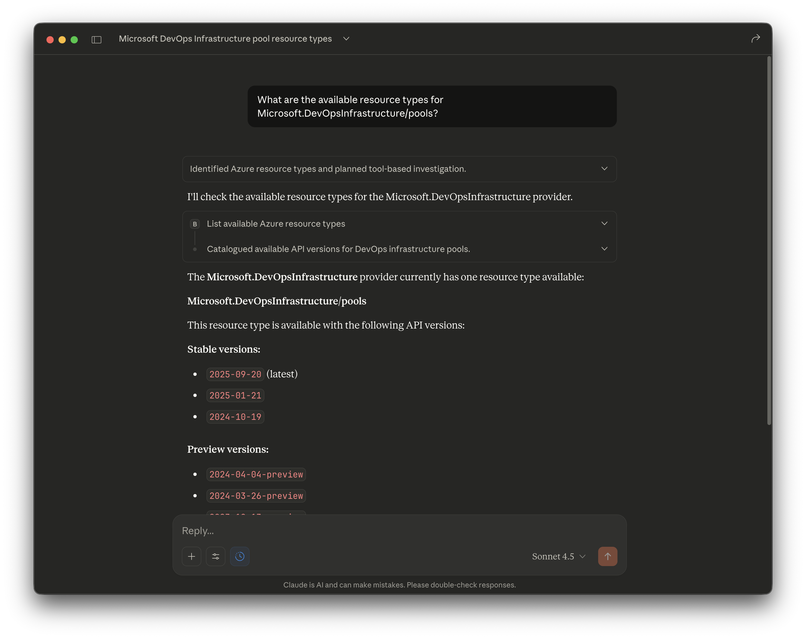

# Using Bicep MCP Server with Claude Desktop

This guide explains how to configure and use the Azure Bicep MCP server with Claude Desktop.



## Prerequisites

- [Claude Desktop](https://claude.ai/download) installed
- [.NET 9.0 SDK](https://dotnet.microsoft.com/download/dotnet/9.0) or later
- Bicep MCP Server built (run `./scripts/Setup-BicepMCP.ps1` first) or use the VS Code extension method found in [README.md](../README.md#option-2-extract-from-vs-code-extension)

## Quick Setup

### 1. Find Your Configuration File

Open the Claude Desktop configuration file:

| Platform    | Location                                                          |
| ----------- | ----------------------------------------------------------------- |
| **macOS**   | `~/Library/Application Support/Claude/claude_desktop_config.json` |
| **Windows** | `%APPDATA%\Claude\claude_desktop_config.json`                     |

### 2. Add the Bicep MCP Server

Edit the configuration file and add the Bicep server:

```json
{
  "mcpServers": {
    "bicep": {
      "command": "dotnet",
      "args": [
        "Path to your Bicep.McpServer.dll"
      ]
    }
  }
}
```

> **Important**: Replace the path with your actual path to `Bicep.McpServer.dll`

### 3. Restart Claude Desktop

Quit and reopen Claude Desktop for the changes to take effect.

## Step-by-Step Setup

### 1. Find Your MCP Server Path

```bash
# Navigate to your project
cd <Path to your cloned azure-bicep-mcp-local repository>

# Find the built DLL
find bicep/src/Bicep.McpServer/bin/Release -name "Bicep.McpServer.dll"
```

### 2. Open the Configuration File

#### macOS

```bash
# Create the directory if it doesn't exist
mkdir -p ~/Library/Application\ Support/Claude

# Open the config file (creates it if it doesn't exist)
open -e ~/Library/Application\ Support/Claude/claude_desktop_config.json
```

Or use VS Code:

```bash
code ~/Library/Application\ Support/Claude/claude_desktop_config.json
```

#### Windows

```powershell
# Open in VS Code
code $env:APPDATA\Claude\claude_desktop_config.json
```

### 3. Configure the MCP Server

If the file is empty or doesn't exist, create it with this content:

```json
{
  "mcpServers": {
    "bicep": {
      "command": "dotnet",
      "args": [
        "/Users/<user>/Documents/Repositories/azure-bicep-mcp-local-experiment/bicep/src/Bicep.McpServer/bin/Release/net10.0/Bicep.McpServer.dll"
      ]
    }
  }
}
```

If the file already exists with other MCP servers, add the Bicep server to the existing `mcpServers` object:

```json
{
  "mcpServers": {
    "existing-server": {
      "command": "...",
      "args": ["..."]
    },
    "bicep": {
      "command": "dotnet",
      "args": [
        "/Users/<user>/Documents/Repositories/azure-bicep-mcp-local-experiment/bicep/src/Bicep.McpServer/bin/Release/net10.0/Bicep.McpServer.dll"
      ]
    }
  }
}
```

### 4. Restart Claude Desktop

1. Quit Claude Desktop completely (Cmd+Q on macOS, Alt+F4 on Windows)
2. Reopen Claude Desktop
3. The Bicep MCP server should now be available under tools

### 5. Verify the Server is Connected

In Claude Desktop you can ask Claude:

```
What MCP tools do you have access to?
```

to see the list of available tools.

## Available Tools

Once connected, Claude Desktop has access to these Bicep tools:

| Tool                                  | Description                                                                      |
| ------------------------------------- | -------------------------------------------------------------------------------- |
| `list_az_resource_types_for_provider` | Lists all Azure resource types for a specific provider (e.g., Microsoft.Storage) |
| `get_az_resource_type_schema`         | Gets the schema for a specific Azure resource type and API version               |
| `get_bicep_best_practices`            | Returns Bicep coding best practices and guidelines                               |
| `list_avm_metadata`                   | Lists metadata for all Azure Verified Modules (AVM)                              |

## Example Usage

Once the MCP server is connected, you can ask Claude things like:

- "What are the best practices for writing Bicep code?"
- "Show me the schema for Microsoft.Storage/storageAccounts@2023-01-01"
- "List all resource types in the Microsoft.Web provider"
- "What Azure Verified Modules are available for networking?"
- "Help me create a Bicep template for an Azure Function App"
