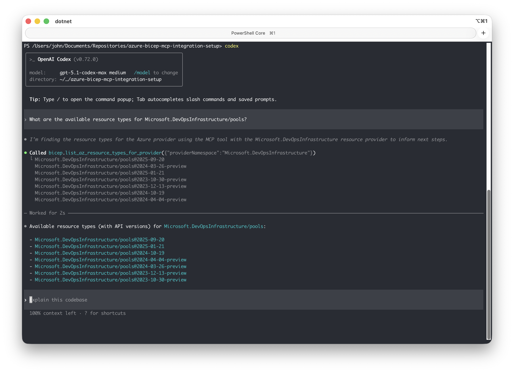

# Using Bicep MCP Server with Codex CLI

This guide explains how to configure and use the Azure Bicep MCP server with Codex CLI.



## Prerequisites

- [Codex CLI](https://developers.openai.com/codex/cli/) installed and authenticated
- [.NET 10.0 SDK](https://dotnet.microsoft.com/en-us/download/dotnet/10.0?WT.mc_id=MVP_323261) or later
- Bicep MCP Server built (run `./scripts/Setup-BicepMCP.ps1` first) or use the VS Code extension method found in [README.md](../README.md#option-2-extract-from-vs-code-extension-easiest-approach)

## Quick Setup

Run this single command to add the Bicep MCP server:

```bash
codex mcp add bicep -- dotnet /path/to/Bicep.McpServer.dll
```

> **Note**: Replace the path with your actual path to `Bicep.McpServer.dll`

## Step-by-Step Setup

### 1. Find Your MCP Server Path

```bash
# Navigate to your project
cd <Path to your cloned azure-bicep-mcp-local repository>

# Find the built DLL
find bicep/src/Bicep.McpServer/bin/Release -name "Bicep.McpServer.dll"
```

If you use the VS Code extension method, the path may look like this:

```bash
~/.vscode/extensions/ms-azuretools.vscode-bicep-0.39.26/bicepMcpServer/Bicep.McpServer.dll
```

### 2. Add the MCP Server

Run:

```
codex mcp add bicep -- dotnet /path/to/Bicep.McpServer.dll
```

### 3. Verify the Server is Configured

```bash
# List all configured MCP servers
codex mcp list

# Get details for the Bicep server
codex mcp get bicep
```

### 4. Check Server Status in Codex CLI

Within a Codex CLI session, use:

```
/mcp
```

This displays all connected MCP servers and their status.

## Available Tools

Once connected, Codex CLI has access to these Bicep tools:

| Tool                                  | Description                                                                      |
| ------------------------------------- | -------------------------------------------------------------------------------- |
| `list_az_resource_types_for_provider` | Lists all Azure resource types for a specific provider (e.g., Microsoft.Storage) |
| `get_az_resource_type_schema`         | Gets the schema for a specific Azure resource type and API version               |
| `get_bicep_best_practices`            | Returns Bicep coding best practices and guidelines                               |
| `list_avm_metadata`                   | Lists metadata for all Azure Verified Modules (AVM)                              |

## Example Usage

Once the MCP server is connected, you can ask Codex CLI things like:

```
> What are the best practices for writing Bicep code?

> Show me the schema for Microsoft.Storage/storageAccounts@2023-01-01

> List all resource types in the Microsoft.Web provider

> What Azure Verified Modules are available for networking?

> Help me create a Bicep template for an Azure Function App
```
