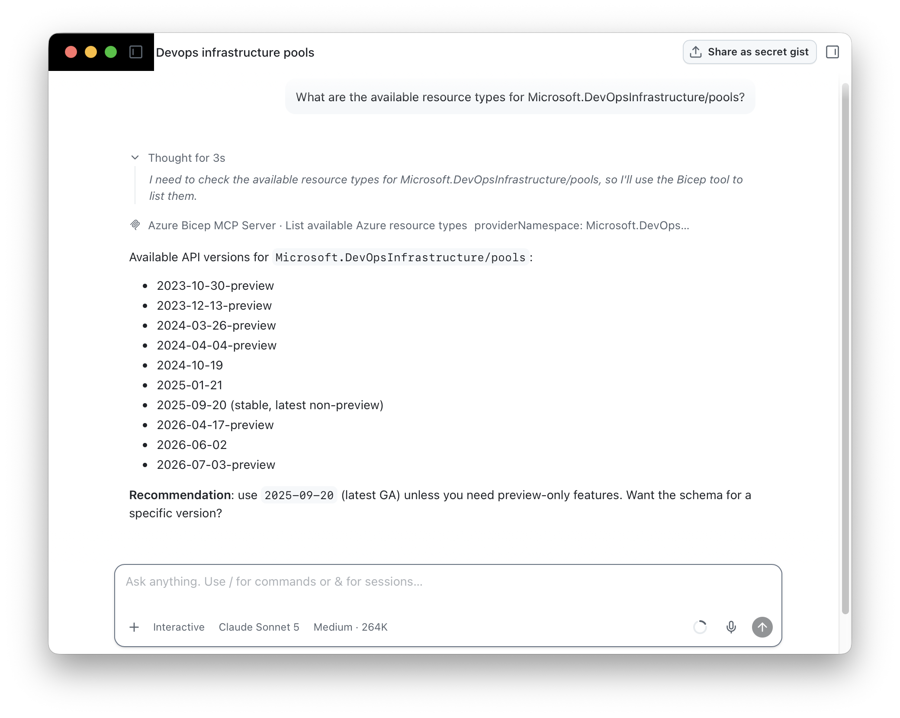
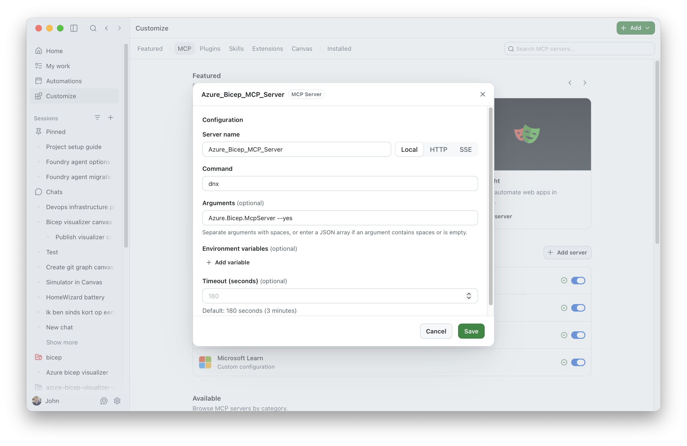

# Using Bicep MCP Server with GitHub Copilot App

This guide explains how to configure and use the Azure Bicep MCP server with GitHub Copilot App.



## Prerequisites

- [GitHub Copilot App](https://github.com/features/ai/github-app) installed and authenticated
- [.NET 10.0 SDK](https://dotnet.microsoft.com/en-us/download/dotnet/10.0?WT.mc_id=MVP_323261) or later
- Bicep MCP Server available via one of the options in [README.md](../README.md#options)

## Quick Setup

Choose one of the following options:

### Use dnx

Open the GitHub Copilot App and navigate to **Customize** > **MCP** and click **Add server**. Then, fill in the details as follows and click save to use the Bicep MCP server in the GitHub Copilot App:



| Field       | Value                                                         |
| ----------- | ------------------------------------------------------------- |
| Name        | Azure_Bicep_MCP_Server                                        |
| Server Type | Local                                                         |
| Command     | `dnx`
| Arguments   | `Azure.Bicep.McpServer --yes`                                 |

## Available Tools

Once connected, GitHub Copilot App has access to these Bicep tools:

| Tool                                  | Description                                                                                                                  |
| ------------------------------------- | ---------------------------------------------------------------------------------------------------------------------------- |
| `list_az_resource_types_for_provider` | Lists all Azure resource types for a specific provider (e.g., Microsoft.Storage)                                             |
| `get_az_resource_type_schema`         | Gets the schema for a specific Azure resource type and API version                                                           |
| `get_bicep_best_practices`            | Returns Bicep coding best practices and guidelines                                                                           |
| `decompile_arm_parameters_file`       | Converts ARM template parameter JSON files into Bicep parameters format (.bicepparam).                                       |
| `decompile_arm_template_file`         | Converts ARM template JSON files into Bicep syntax (.bicep).                                                                 |
| `format_bicep_file`                   | Applies consistent formatting (indentation, spacing, line breaks) to Bicep files.                                            |
| `get_bicep_file_diagnostics`          | Analyzes a Bicep file and returns all compilation diagnostics.                                                               |
| `get_file_references`                 | Analyzes a Bicep file and returns a list of all referenced files including modules, parameter files, and other dependencies. |
| `get_deployment_snapshot`             | Creates a snapshot from a .bicepparam file to preview resources and compare Bicep implementations.                           |
| `list_avm_metadata`                   | Lists metadata for all Azure Verified Modules (AVM)                                                                          |

## Example Usage

Once the MCP server is connected, you can ask GitHub Copilot App things like:

```text
> What are the best practices for writing Bicep code?

> Show me the schema for Microsoft.Storage/storageAccounts@2023-01-01

> List all resource types in the Microsoft.Web provider

> What Azure Verified Modules are available for networking?

> Help me create a Bicep template for an Azure Function App
```
