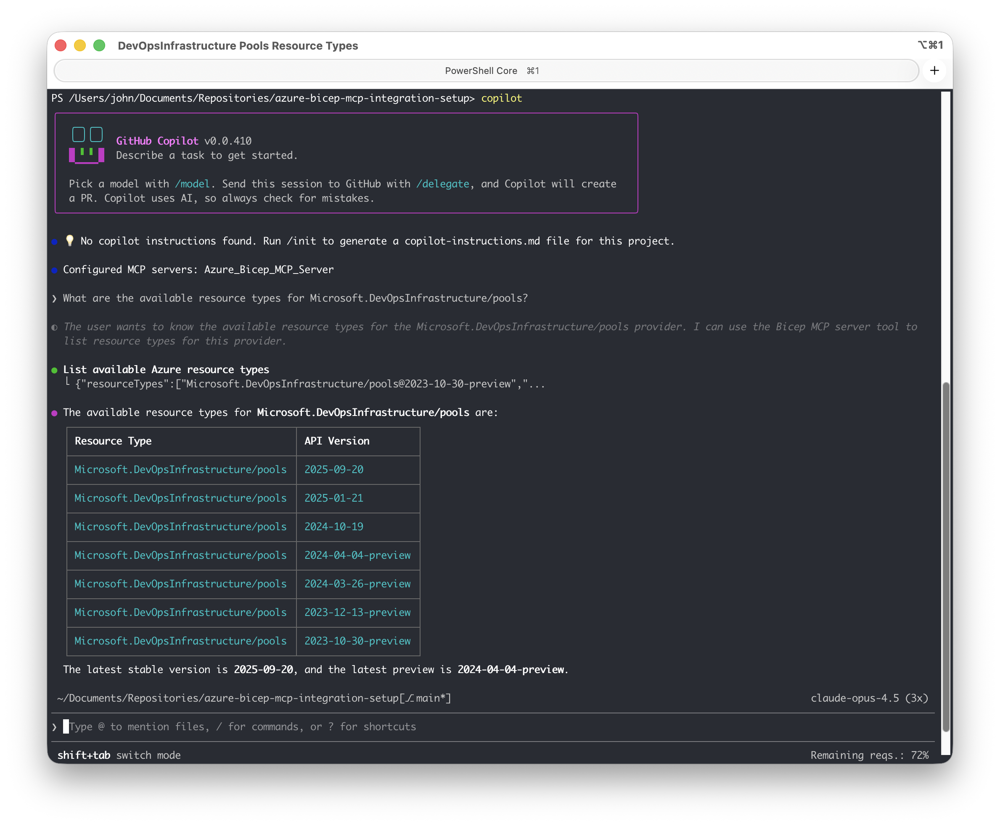
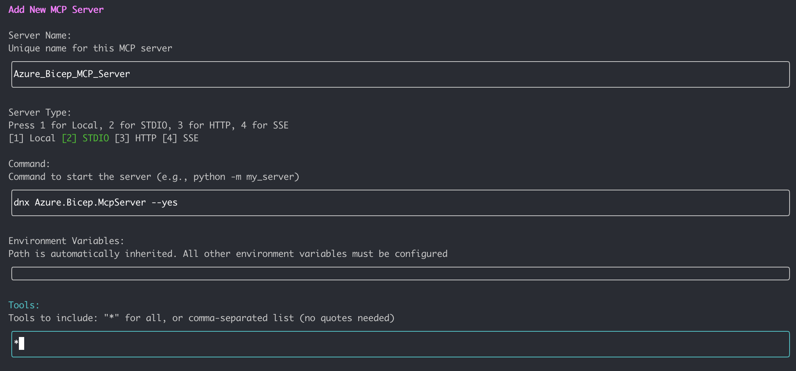

# Using Bicep MCP Server with GitHub Copilot CLI

This guide explains how to configure and use the Azure Bicep MCP server with GitHub Copilot CLI.



## Prerequisites

- [GitHub Copilot CLI](https://docs.github.com/en/copilot/how-tos/copilot-cli/install-copilot-cli#installing-or-updating-copilot-cli) installed and authenticated
- [.NET 10.0 SDK](https://dotnet.microsoft.com/en-us/download/dotnet/10.0?WT.mc_id=MVP_323261) or later
- Bicep MCP Server available via one of the options in [README.md](../README.md#options)

## Quick Setup

Choose one of the following options:

### Option 1 (recommended): Use dnx

First, you need to open GitHub Copilot CLI by running command `copilot` in your terminal. Then, run the following command within the Copilot CLI interface:

```bash
/mcp add
```

This will open a prompt to add a new MCP server. Fill in the details as follows:



| Field       | Value                                                         |
| ----------- | ------------------------------------------------------------- |
| Name        | Azure_Bicep_MCP_Server                                        |
| Server Type | STDIO                                                         |
| Command     | `dnx Azure.Bicep.McpServer --yes`                             |
| Tools       | `*` (or specify individual tools if you want to limit access) |

### Option 2 & 3: Use a local DLL

First, you need to open GitHub Copilot CLI by running command `copilot` in your terminal. Then, run the following command within the Copilot CLI interface:

```bash
/mcp add
```

This will open a prompt to add a new MCP server. Fill in the details as follows:

| Field       | Value                                                         |
| ----------- | ------------------------------------------------------------- |
| Name        | Azure_Bicep_MCP_Server                                        |
| Server Type | STDIO                                                         |
| Command     | `dotnet /path/to/Azure.Bicep.McpServer.dll`                   |
| Tools       | `*` (or specify individual tools if you want to limit access) |

> **Note**: Replace the path with your actual path to `Azure.Bicep.McpServer.dll`

### Find Your MCP Server Path

Only use this step if you are using Option 2 or 3 from the [README.md](../README.md#options) to get the Bicep MCP server DLL.

```bash
# Navigate to your project
cd <Path to your cloned azure-bicep-mcp-local repository>

# Find the built DLL
find bicep/src/Bicep.McpServer/bin/Release -name "Azure.Bicep.McpServer.dll"
```

If you use the VS Code extension method, the path may look like this:

```bash
~/.vscode/extensions/ms-azuretools.vscode-bicep-0.39.26/bicepMcpServer/Azure.Bicep.McpServer.dll
```

### Verify if the Server is Configured

First open GitHub Copilot CLI by running command `copilot` in your terminal. Then, run the following commands within the Copilot CLI interface:

```bash
# List all configured MCP servers
/mcp list

# Get details for the Bicep server
/mcp show Azure_Bicep_MCP_Server
```

### Configuration file

Additionally, you can also configure the MCP server by directly editing the configuration file. The configuration file is located at `~/.copilot/mcp-config.json` on Linux and macOS, and `%APPDATA%\copilot\mcp-config.json` on Windows.

Make sure to add an entry for the Bicep MCP server with the appropriate details. For example:

```json
{
  "mcpServers": {
    "Azure_Bicep_MCP_Server": {
      "type": "stdio",
      "command": "dnx",
      "tools": [
        "*"
      ],
      "args": [
        "Azure.Bicep.McpServer",
        "--yes"
      ]
    }
  }
}
```

## Available Tools

Once connected, GitHub Copilot CLI has access to these Bicep tools:

| Tool                                  | Description                                                                                                                  |
| ------------------------------------- | ---------------------------------------------------------------------------------------------------------------------------- |
| `list_az_resource_types_for_provider` | Lists all Azure resource types for a specific provider (e.g., Microsoft.Storage)                                             |
| `get_az_resource_type_schema`         | Gets the schema for a specific Azure resource type and API version                                                           |
| `get_bicep_best_practices`            | Returns Bicep coding best practices and guidelines                                                                           |
| `decompile_arm_parameters_file`       | Converts ARM template parameter JSON files into Bicep parameters format (.bicepparam).                                       |
| `decompile_arm_template_file`         | Converts ARM template JSON files into Bicep syntax (.bicep).                                                                 |
| `format_bicep_file`                   | Applies consistent formatting (indentation, spacing, line breaks) to Bicep files.                                            |
| `get_bicep_file_diagnostics`          | Analyzes a Bicep file and returns all compilation diagnostics.                                                               |
| `get_file_references`                 | Analyzes a Bicep file and returns a list of all referenced files including modules, parameter files, and other dependencies. |
| `get_deployment_snapshot`             | Creates a snapshot from a .bicepparam file to preview resources and compare Bicep implementations.                           |
| `list_avm_metadata`                   | Lists metadata for all Azure Verified Modules (AVM)                                                                          |

## Example Usage

Once the MCP server is connected, you can ask GitHub Copilot CLI things like:

```text
> What are the best practices for writing Bicep code?

> Show me the schema for Microsoft.Storage/storageAccounts@2023-01-01

> List all resource types in the Microsoft.Web provider

> What Azure Verified Modules are available for networking?

> Help me create a Bicep template for an Azure Function App
```
