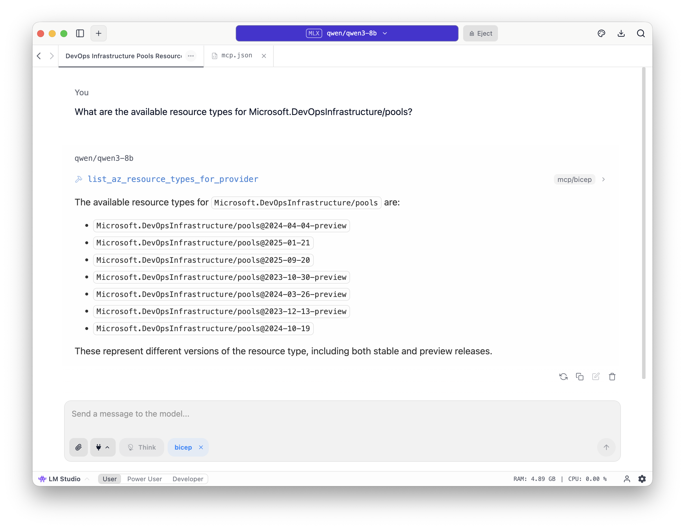

# Using Bicep MCP Server with LMStudio

This guide explains how to configure and use the Azure Bicep MCP server with LMStudio.



## Prerequisites

- [Claude Desktop](https://claude.ai/download) installed
- [.NET 10.0 SDK](https://dotnet.microsoft.com/en-us/download/dotnet/10.0?WT.mc_id=MVP_323261) or later
- Bicep MCP Server built (run `./scripts/Setup-BicepMCP.ps1` first) or use the VS Code extension method found in [README.md](../README.md#option-2-extract-from-vs-code-extension-easiest-approach)

## Quick Setup

### 1. Open the MCP.json file in LMStudio

Open LMStudio and navigate to the MCP configuration file to add the following snippet:

```json
{
  "mcpServers": {
    "bicep": {
      "command": "dotnet",
      "args": [
        "Path to your Bicep.McpServer.dll"
      ]
    }
  }
}
```

### 2. Select the Bicep MCP Server

In LMStudio, go to the MCP server selection (called "Integrations") and choose the "bicep" server you just added.

### 3. Write your prompt

You can now start writing prompts that utilise the Bicep MCP server for Azure Bicep-related tasks.

## Available Tools

Once connected, LMStudio has access to these Bicep tools:

| Tool                                  | Description                                                                      |
| ------------------------------------- | -------------------------------------------------------------------------------- |
| `list_az_resource_types_for_provider` | Lists all Azure resource types for a specific provider (e.g., Microsoft.Storage) |
| `get_az_resource_type_schema`         | Gets the schema for a specific Azure resource type and API version               |
| `get_bicep_best_practices`            | Returns Bicep coding best practices and guidelines                               |
| `list_avm_metadata`                   | Lists metadata for all Azure Verified Modules (AVM)                              |

## Example Usage

Once the MCP server is connected, you can ask any model in LMStudio things like:

- "What are the best practices for writing Bicep code?"
- "Show me the schema for Microsoft.Storage/storageAccounts@2023-01-01"
- "List all resource types in the Microsoft.Web provider"
- "What Azure Verified Modules are available for networking?"
- "Help me create a Bicep template for an Azure Function App"
